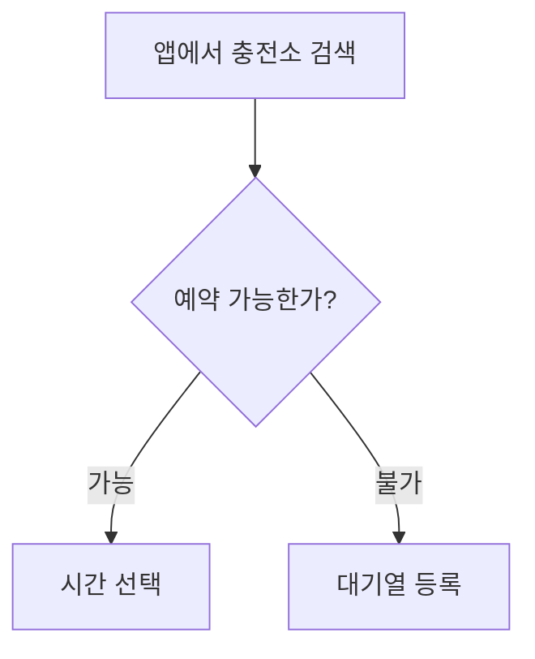

# 기획서 리뷰

기획서를 올리면 팀원이 **문장에 직접** 의견을 남기는 사내 리뷰 사이트.
계정은 이슈트래커(test-system)와 같은 걸 쓴다.

## 화면 4개

| 경로 | 화면 | 하는 일 |
| --- | --- | --- |
| `/login` | 로그인 | 이슈트래커와 같은 Firebase 계정 |
| `/` | 시스템 선택 | 서비스·제품 목록 |
| `/s/:systemId` | 기획서 선택 | 그 시스템의 기획서 목록, 올리기 |
| `/s/:systemId/d/:docId` | 기획서 | 본문 + 피드백 + PDF 다운로드 |

## 피드백 세 가지

- **문장** — 본문에서 드래그하면 그 자리에 하이라이트로 붙는다 (노션 방식)
- **문단** — 문단 오른쪽 `+` 를 누르면 문단 전체에 붙는다 (컨플루언스 방식)
- **전체 덧글** — 문서 전체에 대한 의견

답글은 한 단계까지. 해결/다시 열기, 본인 글 수정·삭제가 된다.
남이 단 댓글은 새로고침 없이 바로 뜬다 (`onSnapshot`).

## 고치기 — 화면에서 바로

`고치기` 를 누르면 모달 없이 **보던 자리가 그대로 편집기로** 바뀐다. 마크다운 문법을
몰라도 되고, 툴바로 넣는다.

제목 1~3 · 굵게·기울임·취소선·인라인코드 · 링크 · 글머리/번호/체크 목록 · 인용 ·
코드블록 · **표**(행·열 추가·삭제·병합) · **다이어그램** · 구분선 · 이미지

- **이미지**는 붙여넣기·끌어놓기로 바로 올라간다 (이슈트래커와 같은 Cloudinary)
- **다이어그램**은 블록을 누르면 mermaid 코드 칸이 열리고, 닫으면 그림으로 돌아온다
- 편집하는 동안 댓글 사이드바는 그대로 보인다. 새 덧글만 막고 답글은 된다
- 편집기(Tiptap·아이콘)는 `고치기` 를 누를 때만 받아온다

### 저장 형식이 HTML 인 이유

위지윅 편집기가 다루는 형식이 곧 HTML 이라 그걸 그대로 저장한다. 마크다운으로 올린
문서는 **올리는 시점에 한 번** HTML 로 바꿔 넣는다.

다이어그램만은 `<div data-mermaid-src="...">` 가 아니라 마크다운과 같은
```` ```mermaid ```` 코드블록으로 저장한다. DOMPurify 가 `-->` 가 들어간 속성값을
통째로 지우는데(mXSS 방어), mermaid 화살표가 전부 `-->` 라서 속성에 담으면 다시 읽을 때
코드가 사라진다.

### 편집기를 거쳐도 문단이 안 어긋나게

마크다운 변환기는 `<li>글자</li>` 를 만들지만 편집기는 `<li><p>글자</p></li>` 로
되돌린다(표 칸도 같다). 그대로 두면 `li`·`tr` 이 최말단 문단이 아니게 되면서 문단
단위가 통째로 달라지고, 거기 달린 댓글이 전부 위치를 잃는다. 그래서 렌더 전에 이
문단 껍데기를 벗겨 양쪽 모양을 맞춘다 (`unwrapContainerParagraphs`).

표의 행은 한 가지 더 있다. 변환기는 칸 사이에 줄바꿈을 넣고 편집기는 안 넣어서
`textContent` 를 그냥 쓰면 `"가 나 다"` 와 `"가나다"` 로 갈린다. 칸 단위로 뽑아
한 칸씩 띄워 붙인다 (`blockText`).

> 실제 기획서(36KB · 문단 227개 · 표 11개 · 다이어그램 5개)로 왕복을 확인했다.
> 편집기를 통과시킨 뒤에도 문단 227개가 그대로였고 잃은 문단은 없었다.
> **이 규칙 중 하나라도 건드리면 그 확인을 다시 해야 한다.**

## 기획서를 고쳐도 피드백이 안 떨어지는 이유

문단마다 붙는 `data-block-id` 는 **위치가 아니라 문단 텍스트의 해시**다.

```
b_<본문 해시 16자>_<같은 문장의 몇 번째인지>
```

그래서 문서 앞에 절을 새로 끼워 넣어도 뒤쪽 문단의 id 는 그대로고, 거기 달린
피드백도 그 자리에 남는다. 문단이 실제로 사라지면 그 피드백만 사이드바의
**"위치를 잃은 피드백"** 으로 모인다. 지우지는 않는다.

인라인 댓글은 여기에 더해 `문단 안 문자 위치 + 인용문`을 같이 저장한다.
위치가 어긋나면 인용문으로 다시 찾고, 그것도 없으면 위치를 잃은 걸로 본다.

> ⚠️ 해시 규칙(`src/lib/blocks.ts`)은 한번 정하면 못 바꾼다.
> 바꾸는 순간 이미 달린 댓글이 전부 길을 잃는다.

## PDF 다운로드

버튼을 누르면 파일이 바로 떨어진다. 인쇄 창을 거치지 않는다.

- **글자를 드래그해 복사할 수 있고 `Cmd+F` 검색도 된다.** 화면을 사진 찍는 게
  아니라 문서 구조를 PDF 로 다시 그리기 때문
- **다이어그램도 벡터로 들어간다.** mermaid 가 만든 SVG 를 그대로 넣어서
  확대해도 안 깨지고, 도형 안 글자도 텍스트로 남는다
- 댓글·하이라이트는 들어가지 않는다. 본문만 나온다
- 종이 방향(세로/가로)은 기획서별로 정한다 — **고치기** 창 아래쪽
- 다이어그램과 표는 페이지 경계에서 안 잘리게 통째로 다음 장으로 넘긴다

무거운 것(pdfmake, mermaid, 한글 폰트 2.5MB×2)은 다운로드를 누른 뒤에 받아온다.
평소 화면 로딩에는 얹히지 않는다.

### 다이어그램 그리기

기획서 안에 ```` ```mermaid ```` 코드블록을 쓰면 된다.

````markdown

````

세로로 긴 순서도는 `flowchart LR` 로 눕히거나, 기획서의 PDF 방향을 가로로 두면
한 장에 크게 들어간다.

## 시작하기

```bash
npm install
cp .env.example .env.local   # 값을 채운다
npm run dev
```

### 1. 디자인시스템 설치 토큰

`@great-mangofarm/mango-ui` 는 GitHub Packages 에 있어서 토큰이 필요하다.

```bash
export NODE_AUTH_TOKEN=$(gh auth token -u great-mangofarm)
npm install
```

### 2. Firebase 설정값

이슈트래커와 **같은 Firebase 프로젝트**를 본다. 그래야 계정이 그대로 먹힌다.
Cloudflare Pages 환경변수나 Firebase 콘솔 → 프로젝트 설정 → 내 앱에서 6개를 복사해
`.env.local` 에 넣는다. 이 파일은 커밋하지 않는다.

### 3. Firestore 규칙 게시

`firestore.rules` 의 `spec*` 블록 3개를 Firebase 콘솔 → Firestore Database →
규칙에 **이어 붙이고** [게시] 를 눌러야 한다. 기존 규칙은 지우지 말 것.
배포로는 반영되지 않는다.

## 데이터

기존 컬렉션은 **읽기만** 한다 (`users`). 새로 만드는 건 이 셋뿐이다.

```
specSystems/{id}    시스템 (서비스·제품)
specDocs/{id}       기획서 — 본문까지 한 문서에 담는다
specComments/{id}   댓글·답글
```

이슈트래커의 평면 구조 관례를 따랐다. 복합 색인은 필요 없다 —
`where` 만 쓰고 정렬은 받아온 뒤에 한다.

Firestore 문서 하나가 1MB 를 못 넘어서, 기획서 본문은 **700KB** 로 제한한다.

## 권한

`users/{uid}.role` 을 본다.

| | admin·pm | 그 외 (developer·staff) |
| --- | --- | --- |
| 시스템 추가·수정·삭제 | ○ | × |
| 기획서 올리기·고치기·삭제 | ○ | × |
| 댓글 달기 | ○ | ○ |
| 해결/다시 열기 | ○ | ○ |
| 본인 댓글 수정·삭제 | ○ | ○ |
| 남의 댓글 삭제 | ○ | × |

## 배포 (Cloudflare Pages)

GitHub 저장소를 연결해두면 **main 에 push 하는 것이 곧 배포**다.
주소는 두 개가 같은 배포물을 가리킨다.

- **https://spec.datasystem.app** — 커스텀 도메인. `datasystem.app` zone 에
  `spec` CNAME 을 `spec-review.pages.dev` 로 두었다 (DNS only)
- **https://spec-review.pages.dev** — 프로젝트 이름으로 자동 붙는 기본 주소

| 항목 | 값 |
| --- | --- |
| 빌드 명령 | `npm run build` |
| 출력 디렉터리 | `dist` |

**환경변수**(Production·Preview 양쪽에 넣을 것)

- `NODE_AUTH_TOKEN` — mango-ui 가 GitHub Packages 에 있어서 설치에 필요하다.
  `gh auth token -u great-mangofarm` 로 얻는다.
- `VITE_FIREBASE_*` 6개 — `.env.example` 참고

Node 버전은 `.node-version` 으로 고정해뒀다.

`public/_redirects` 가 SPA 새로고침을 받아준다. 이게 없으면 `/s/xxx` 에서
새로고침할 때 404 가 뜬다.

`public/fonts/` 의 Pretendard TTF 두 개는 PDF 에 글꼴을 심는 데 쓰인다.
빌드 결과에 그대로 들어가니 지우지 말 것.

배포한 도메인은 **Firebase 콘솔 → Authentication → Settings → 승인된 도메인**에
등록해야 로그인이 된다. 위 두 주소는 등록해뒀다.

## 안 넣은 것

- **AI 요약** — 정적 호스팅이라 `claude -p` 를 돌릴 서버가 없다.
  올릴 때 사람이 요약해서 함께 쓰기로 했다.
- **회원가입** — 이슈트래커 계정을 그대로 쓴다. 계정은 거기서 만든다.
